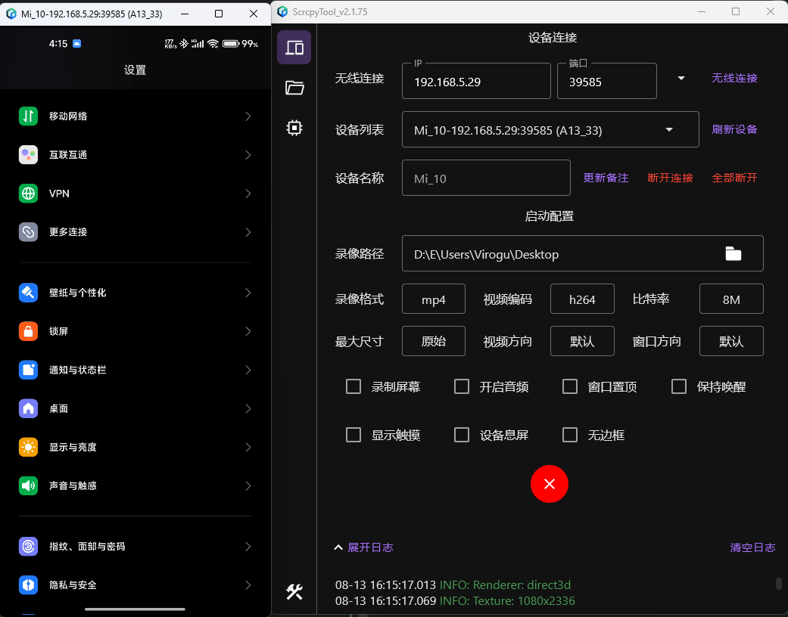
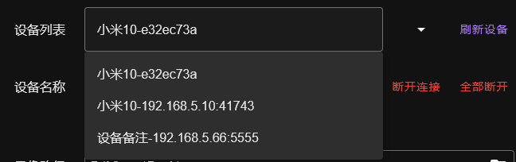

## ComposeScrcpyTool

ComposeScrcpyTool is a tool that allows you to display and control the screen of an Android device via USB or network connection without root permissions.

It supports Windows, Linux, and macOS (theoretically supported, not compiled and tested due to lack of a macOS environment).

The program is developed using [Compose Multiplatform](https://github.com/JetBrains/compose-multiplatform).

### Installation and Running

#### Windows

No additional environment configuration is needed. Double-click the packaged `.msi` installer to install, and you can run it after installation is complete, or unzip the portable `.zip` version to a custom directory.

Try not to install on the C drive; if installed there, you might need to run it with administrator privileges.

#### Linux

The following systems have been tested and can be used directly after installation. Other systems should be tested by the user:

- LinuxMint 20.3 Cinnamon Edition (Ubuntu Focal)
- Deepin 20.9
- WSL2 Ubuntu 22.04.3 LTS
- Linux Mint 21.2

```cmd
sudo dpkg -i ScrcpyTool-x.x.x-xx.deb
```

Runtime dependencies (might not need installation as many systems already include these):

```cmd
sudo apt install ffmpeg libsdl2-2.0-0 libusb-1.0-0
```

If prompted for other dependencies during installation, install them as instructed.

If you encounter:

xdg-desktop-menu: No writable system menu directory found.
Run this:

```cmd
sudo mkdir /usr/share/desktop-directories/
```

#### MacOs

Compilation and testing have not been performed yet. If needed, please supplement the relevant content and compile it yourself.

### Device Requirements

Android version needs to be API21 (Android 5.0) or higher, and USB debugging must be enabled.

OpenHarmony 4.0 (Scrcpy does not support this yet)

Generally, enable `USB debugging` in `Developer options`. Some deeply customized systems might require enabling `Allow USB debugging to modify permissions or simulate clicks` (`USB debugging (security settings)`).
### Main Interface



#### Device Screen Display Interface

Some configuration options and function buttons related to ADB connection:

- **Wireless Connection**: Enter the IP and port of a device with wireless debugging enabled on the same network, then click the `Wireless Connection` button or press `Enter` to connect to that device.

  Usually, you need to enable the `Wireless debugging` feature in developer mode on your phone. For other special devices, enable wireless debugging manually.

  The dropdown list shows previously connected devices, allowing you to pin a frequently used device or delete connection records.

  

- **Device List**: Displays all currently connected devices (both wireless and USB), allowing you to select a device from the dropdown.

  

- **Refresh Devices**: Immediately refreshes the list of connected devices.
- **Device Name**: You can add a note to a selected device for better identification. After entering the note, click `Update Note` or press `Enter` to update the note.
- **Disconnect**: Disconnects the ADB connection of the currently selected device.
- **Disconnect All**: Disconnects all connected devices.

#### Launch Configuration

Configuration items related to scrcpy launch:

- **Recording Path**: The path where screen recordings are saved. Click the file button on the right to choose a file, or drag and drop a folder here to set the path.
- **Recording Format**: The format in which screen recordings are saved, either `mp4` (default) or `mpv`.
- **Video Encoder**: Choose the video encoder, options are `h264` (default), `h265`, or `av1`.
- **Bitrate**: Select the bitrate for screen transmission, default is `8M`.
- **Maximum Size**: Limit the maximum size of the screen, default is `No Limit`.
- **Video Orientation**: Lock the video orientation, default is `Not Locked`.
- **Window Orientation**: Lock the orientation of the screen window, default is `Not Locked`.
- **Record Screen**: Whether to enable screen recording (recording will only occur if a valid recording path is set).
- **Enable Audio**: Whether to enable device audio (requires at least Android 11, otherwise this option will have no effect).
- **Window Always on Top**: Whether to keep the screen window on top after launch.
- **Keep Awake**: Keep the device awake after launch.
- **Show Touches**: Whether to display screen touch operations on the device.
- **Device Screen Off**: Whether to automatically turn off the device screen after launch.
- **Borderless**: Display the device screen in a borderless window.

*Note*: Items marked with `*` will save different configurations for different devices because these settings might not be universally applicable. If you encounter issues with screen display, you can try adjusting these settings before connecting again (usually, modifying `Maximum Size`, `Bitrate`, or `Video Orientation` can resolve most screen display issues).

#### Launch Button

Select a connected device and click the button to start/stop displaying the screen of that device. Supports launching multiple connected devices simultaneously.

### File Management


### Process Management


### Utility Tools


## Open Source Declaration

This project uses the following open source software:

- **scrcpy**: An open-source tool for Android screen mirroring

  Copyright ? 2018 Genymobile

  License: Apache License, Version 2.0

  Source Code: [scrcpy](https://github.com/Genymobile/scrcpy)

  Under the terms of the Apache License, Version 2.0, this project includes the compiled version of this software. Please refer to the following license text or visit [Apache License 2.0](http://www.apache.org/licenses/LICENSE-2.0) for more information.

  **Apache License, Version 2.0**:  
  [scrcpy-LICENSE](https://github.com/Genymobile/scrcpy/blob/master/LICENSE)
