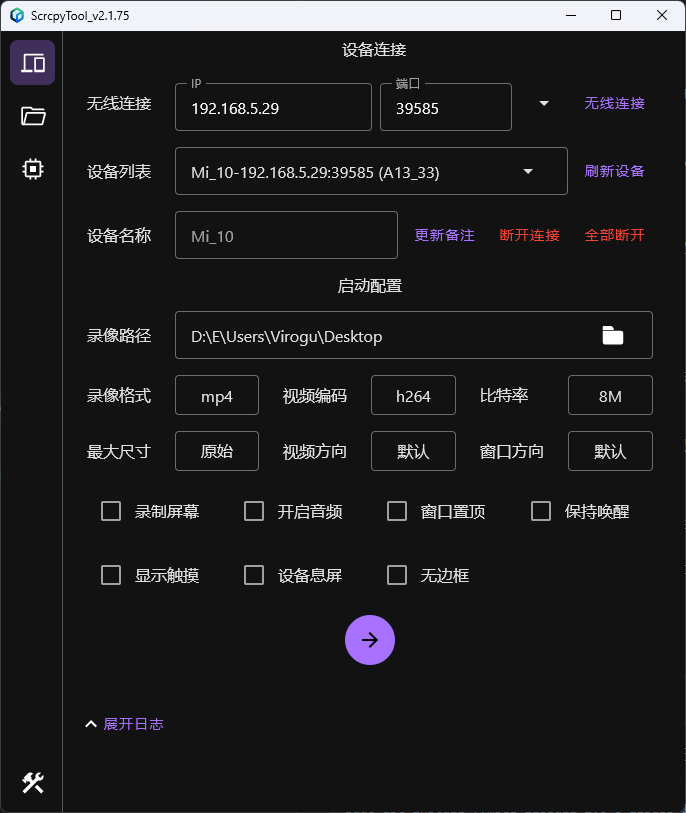
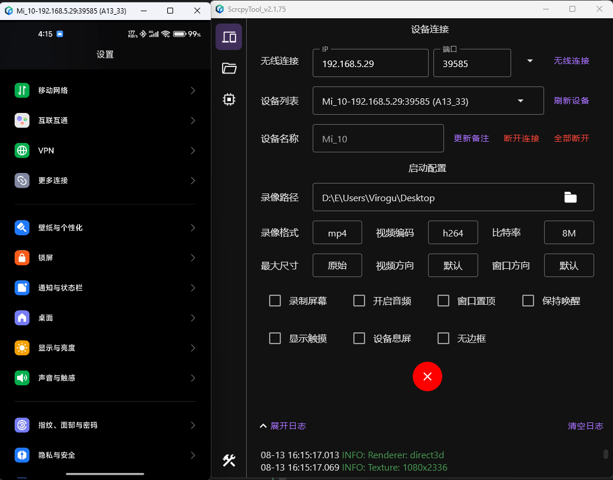
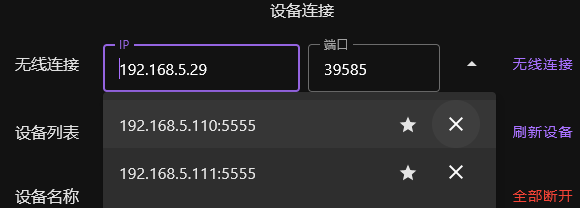
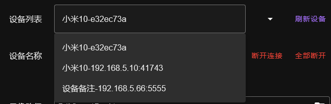

## ComposeScrcpyTool

ComposeScrcpyTool是一款无需root权限即可通过 USB连接/网络连接Android设备，显示设备画面和控制设备的工具。

支持Windows、Linux、MacOS（理论上支持，无MacOs环境，未编译测试）。

程序使用 [Compose Multiplatform](https://github.com/JetBrains/compose-multiplatform) 进行开发

对安卓设备进行画面展示和控制的部分使用了 [Genymobile](https://github.com/Genymobile)
的开源项目 [scrcpy](https://github.com/Genymobile/scrcpy)。

### 界面展示




### 设备要求

Android版本需要API21（Android 5.0），并且要开启USB调试

一般在 `开发者选项` - `USB调试`打开，部分深度定制系统还需要打开`允许USB调试修改权限或模拟点击`(`USB调试（安全设置）`)

### 功能介绍

#### 设备连接

ADB连接相关的一些配置选项以及功能按钮

- 无线连接：输入同一网络下的已开启无线调试的设备IP和端口之后点击`无线连接`按钮或者按`Enter`
  按键即可连接该设备。一般手机需要在开发者模式里面打开 `无线调试` 功能，其他特殊设备需要自行打开无线调试。
  下拉列表可以查看已连接过的设备记录，可以选择置顶某个常用的设备，或者清空设备列表。

  

- 设备列表：展示当前已连接的所有设备（无线连接和USB连接），可以下拉选择设备

  

- 刷新设备：立刻刷新已连接的设备列表
- 设备名称：可以对某个选中的设备添加备注名称以便更好地区分设备，输入备注名称之后点击 `更新备注` 或者按 `Enter` 按钮即可更新备注
- 断开连接：断开当前选择的设备的ADB连接
- 全部断开：断开所有已连接的设备

#### 启动配置

scrcpy启动相关的一些配置项

- 录像路径：设备屏幕录制的文件保存的路径，可以点击右边文件按钮选择文件，或者拖拽文件夹到此处进行设置
- 录像格式：设备屏幕录制文件保存的格式，有 `mp4`（默认） 和 `mpv` 两种格式
- *视频编码：选择视频编码器，有 `h264` (默认)、`h265` 、 `av1`
- *比特率：选择画面传输的比特率，默认`8M`
- *最大尺寸：限制画面的最大尺寸，默认`不限制`
- *视频方向：锁定视频的方向，默认`不锁定`
- *窗口方向：锁定画面窗口的方向，默认`不锁定`
- 录制屏幕：是否开启设备屏幕画面录制（需要设置有效的录像路径才会录制）
- 开启音频：是否开启设备的音频（设备需要至少Android11，否则此选项开启无效）
- 窗口置顶：启动后画面窗口是否置顶展示
- 保持唤醒：启动后保持设备一直处于唤醒状态
- 显示触摸：是否显示设备的屏幕触摸操作
- 设备息屏：启动后是否让设备自动息屏
- 无边框：设备画面展示窗口无边框

注：标有`*`的配置项会针对不同的设备保存不同的配置，因为这几个配置对不同的设备来说不一定通用。如果遇到画面展示异常的问题，可以尝试修改一下这些配置再进行连接（一般情况下，修改一下最大尺寸和比特率可以解决多数画面异常的问题）。

#### 启动按钮

选择某个已连接的设备点击按钮即可启动/关闭该设备画面的展示窗口。支持同时启动连接多个设备。

### 程序安装运行

#### Windows

无需额外环境配置，双击`.msi`安装程序进行安装，安装完成后即可运行

尽量不要安装到C盘，如果安装到了C盘可能需要以管理员身份才能运行

#### Linux

测试在 `LinuxMint 20.3 Cinnamon Edition (Ubuntu Focal)` 和 `Deepin 20.9`上安装完成之后即可直接使用，其他系统需要自测。

```cmd
sudo dpkg -i ScrcpyTool-x.x.x-xx.deb
```

运行环境依赖，在上述系统测试时，系统中默认已经有这些依赖了

```cmd
sudo apt install ffmpeg libsdl2-2.0-0 libusb-1.0-0
```

如果安装时提示

```cmd
xdg-desktop-menu: No writable system menu directory found.
```

执行一下这个

```cmd
sudo mkdir /usr/share/desktop-directories/
```

#### MacOs

暂未进行编译测试 ，需要自行编译